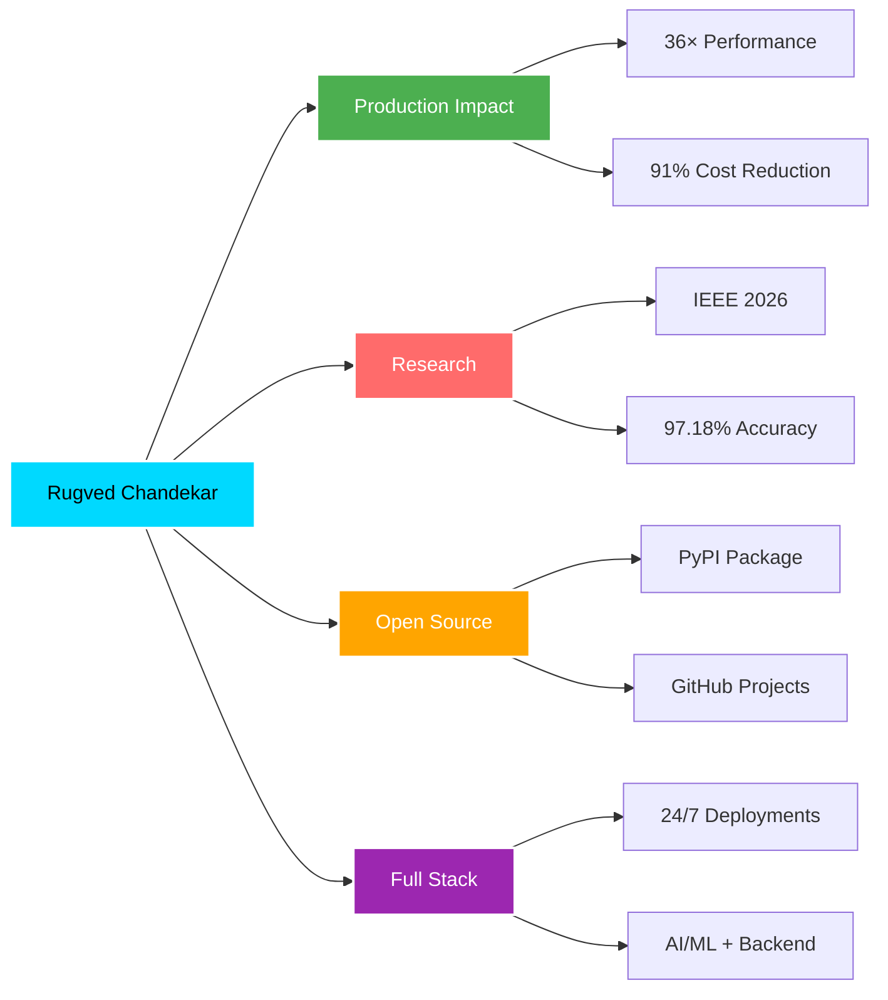

<h1 align="center">
  
</h1>

<div align="center">
  
[](mailto:rugvedchandekar@gmail.com)
[](https://linkedin.com/in/rugvedchandekar)
[](https://github.com/Rugvedrc)
[](https://rugvedrc.github.io/Portfolio/)


</div>


### 👨‍💻 About Me

🚀 **Associate Developer Intern** @ Idyllic Services  
🎓 **B.E. IT** | GEC Chh. Sambhajinagar | **CGPA: 7.27**  
📍 **Location:** Chhatrapati Sambhajinagar, Maharashtra  
💼 **Open to:** Full-time Developer & ML Engineer Roles

```python
class Rugved:
    def __init__(self):
        self.role = "Associate Developer Intern"
        self.company = "Idyllic Services Pvt. Ltd."
        self.education = "B.E. IT | CGPA: 7.27"
        self.looking_for = "Full-time opportunities"
        
    def highlights(self):
        return {
            "⚡ Performance": "36× optimization achieved",
            "📄 Research": "IEEE 2026 submission",
            "🏆 Hackathon": "1st Place Winner",
            "📦 Open Source": "PyPI published library",
            "💰 Cost Savings": "91% LLM token reduction"
        }
    
    def current_focus(self):
        return ["AI Pipelines", "LLMs & RAG", "Production ML"]

rugved = Rugved()
```

<br clear="right"/>

---

## 🔥 Highlights

<div align="center">

| 🎯 Achievement | 📊 Impact |
|:---:|:---:|
| **Performance Optimization** | 36× faster execution |
| **Cost Reduction** | 91% token savings |
| **ML Accuracy** | 97.18% on medical AI |
| **User Impact** | 90% manual effort saved |
| **Research** | IEEE Conference 2026 |

</div>

---


## 🛠️ Tech Arsenal

<div align="center">

### Languages


### AI/ML Frameworks


### Data Science


### Backend & DevOps


</div>


## 💼 Professional Journey

<details open>
<summary><b>🚀 Associate Developer Intern | Idyllic Services Pvt. Ltd.</b></summary>
<br>

**Duration:** Jan 2026 - Present

- 🎯 Developed AI-assisted candidate sourcing pipeline with **36× performance improvement** (6 min → 10 sec)
- 💰 Reduced LLM token usage by **91%** (~200K → ~18K tokens), significantly lowering costs
- ⚙️ Built automated profile extraction, enrichment, and relevance scoring systems
- 🔧 Optimized workflow through intelligent batching and minimal API calls

**Tech Stack:** `Python` `LLMs` `API Optimization` `Data Pipelines`

</details>

---


## 🌟 Featured Projects

<table>
<tr>
<td width="50%">

### 🥇 ResuGenie
[](https://github.com/Rugvedrc/ResuGenie)


**🏆 1st Place - College Hackathon**

AI-powered resume intelligence platform using LLMs & RAG

**Features:**
- 🤖 LLM-based resume parsing (Gemini)
- 🔍 RAG system for JD alignment
- 👥 Alumni-connect for referrals
- 📊 LinkedIn enrichment

**Stack:** `Python` `LLM` `RAG` `FAISS` `Streamlit`

</td>
<td width="50%">

### 🔬 Pneumonia Detection AI
[](https://github.com/Rugvedrc/AI-Powered-Pneumonia-Detection-System)

**📄 IEEE Conference 2026 Submission**

Deep learning for medical diagnosis

**Achievements:**
- 🎯 97.18% accuracy
- 🧠 DenseNet121 + Transfer Learning
- 📈 Multimodal approach
- 🔍 Grad-CAM explainability

**Stack:** `PyTorch` `Computer Vision` `Medical AI`

</td>
</tr>

<tr>
<td width="50%">

### 🕉️ Raghavendra Swami Mutt
[](https://raghavendrasewasangh.in)

**Production Website - 24/7 Uptime**

Full-stack temple management system

**Impact:**
- ⚡ 95% faster bookings
- 📉 90% manual effort saved
- 💳 Payment integration
- 📧 Email notifications

**Stack:** `Flask` `MySQL` `JavaScript` `REST API`

</td>
<td width="50%">

### 👨‍💻 CodeSync
[](https://codesync-collabrative-code-editor.onrender.com/)
[](https://github.com/Rugvedrc/CodeSync-Collabrative-Code-Editor)

Real-time collaborative code editor

**Features:**
- 👥 100+ concurrent users
- 🔄 Real-time sync (WebSockets)
- 🤖 AI code suggestions
- 🎨 Multi-language support

**Stack:** `Flask` `Socket.IO` `LLM` `JavaScript`

</td>
</tr>

<tr>
<td width="50%">

### 🏠 Smart House Price Predictor
[](https://smart-house-price-predictor.onrender.com/)
[](https://github.com/Rugvedrc/Smart-House-Price-Predictor)

ML-powered price prediction

**Highlights:**
- 📊 R² Score: 0.88
- 🔍 SHAP explainability
- ⚙️ Feature engineering
- 🚀 Flask deployment

**Stack:** `XGBoost` `Flask` `SHAP` `Scikit-learn`

</td>
<td width="50%">

### 👁️ YOLOv3 Object Detection
[](https://github.com/Rugvedrc/Object_Detection)

Real-time object detection app

**Features:**
- 📸 Image upload detection
- 🎥 Live webcam feed
- 🎯 Confidence scoring
- ⚡ NMS optimization

**Stack:** `YOLOv3` `OpenCV` `Streamlit`

</td>
</tr>
</table>

<div align="center">

### 🔗 [View More Projects →](https://github.com/Rugvedrc?tab=repositories)

</div>

---


## 📊 GitHub Analytics

<div align="center">
 


</div>

### 📈 Contribution Activity

[](https://github.com/Rugvedrc)


## 🏆 Achievements & Recognition

<div align="center">

| 🎯 Category | 🏅 Achievement |
|:---:|:---|
| 🔬 **Research** | IEEE Conference 2026 - "Uncertainty-Aware Attention Mechanism for Pneumonia Detection" (submitted, under review) |
| 🏆 **Hackathon** | 1st Place Winner - ResuGenie AI Resume Parser |
| 📦 **Open Source** | Published `integration-smoke-test` library on PyPI for CI/CD health checks |
| 🎓 **Certification** | Tata GenAI Powered Data Analytics Job Simulation (Forage) |
| 👨‍🏫 **Leadership** | CP & DSA Lead @ Hackslash - Mentored 300+ students |
| 🎯 **Workshops** | Conducted 5+ coding competitions and hackathons |

</div>

---


## 🎯 What Sets Me Apart?

<div align="center">



</div>

<br>

<table align="center">
<tr>
<td align="center" width="33%">

<br><b>Production Ready</b>
<br>36× optimizations
<br>24/7 deployments
</td>
<td align="center" width="33%">

<br><b>Research Driven</b>
<br>IEEE publications
<br>97.18% accuracy
</td>
<td align="center" width="33%">

<br><b>Open Source</b>
<br>PyPI packages
<br>Community impact
</td>
</tr>
</table>

---


## 🎓 Education

<div align="center">

| 🎯 Degree | 🏫 Institution | 📊 Score | 📅 Year |
|:---:|:---|:---:|:---:|
| **B.E. Information Technology** | Government Engineering College, Chh. Sambhajinagar | CGPA: 7.27 | 2022-2026 |
| **XII (HSC)** | Mallick Junior College, Chh. Sambhajinagar | 87.17% | 2022 |
| **X (ICSE)** | Ryan International School, Chh. Sambhajinagar | 81.20% | 2020 |

</div>

---


## 🤝 Let's Connect!

<div align="center">


### 💼 Open to Full-Time Opportunities!

I'm actively seeking **Software Developer** and **ML Engineer** roles where I can leverage my experience in building production-ready AI systems, optimizing performance, and delivering impactful solutions.

**Let's build something amazing together! 🚀**

<br>

[](mailto:rugvedchandekar@gmail.com)
[](https://linkedin.com/in/rugvedchandekar)
[](https://rugvedrc.github.io/Portfolio/)

<br>

**📧 rugvedchandekar@gmail.com**

</div>

---

<div align="center">

### 💙 Support My Work

If you find my projects helpful or interesting, consider giving them a ⭐!


<sub>Made with ❤️ by Rugved Chandekar | Open to collaboration and opportunities</sub>

[](https://visitorbadge.io/status?path=Rugvedrc)

</div>


